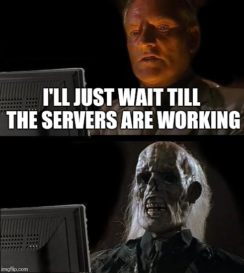

# Issue Summary:

## Duration: The outage lasted from February 15, 2024, 10:00 PM to February 16, 2024, 2:00 AM (UTC).
 Impact:The core service was down, resulting in a complete loss of functionality for all users accessing the platform. Approximately 75% of users were affected, experiencing errors and timeouts during their interactions.

## Timeline:

- 10:00 PM (UTC):Issue detected through monitoring alerts indicating a spike in error rates and server response times.
- 10:05 PM: Engineers noticed abnormal behavior and initiated investigations.
- 10:15 PM: Initial assumption suggested a possible database overload due to increased traffic.
- 10:30 PM: Further investigation focused on database performance and network connectivity issues.
- 11:00 PM: Misleading paths explored, including potential DDoS attacks and application code bugs.
- 12:00 AM: Incident escalated to senior engineers and management for additional support.
- 1:00 AM: Root cause identified as a misconfigured load balancer causing uneven distribution of traffic and overloading specific servers.
- 2:00 AM: Issue resolved by reconfiguring the load balancer settings and redistributing traffic evenly across all servers.

# Root Cause and Resolution:

The root cause of the outage was traced back to a misconfiguration in the load balancer settings, leading to an uneven distribution of incoming traffic. This resulted in certain servers being overloaded while others remained underutilized, causing performance degradation and eventually service failure.

To resolve the issue, engineers reconfigured the load balancer settings to evenly distribute traffic across all available servers. Additionally, monitoring and alerting mechanisms were enhanced to promptly detect and respond to similar issues in the future.

## Corrective and Preventative Measures:

- Improvements/Fixes:
  1. Implement automated load balancer configuration checks to prevent misconfigurations.
  2. Enhance monitoring systems to detect performance anomalies and load balancing issues in real-time.
  3. Conduct regular load testing to ensure the infrastructure can handle expected traffic fluctuations.

- Tasks:
  1. Implement automated load balancer configuration validation scripts.
  2. Enhance monitoring alerts to include specific metrics related to load balancer performance.
  3. Schedule regular load testing exercises to simulate traffic spikes and ensure system resilience.

By implementing these measures, we aim to minimize the risk of similar incidents occurring in the future and improve the overall reliability and performance of our platform.
